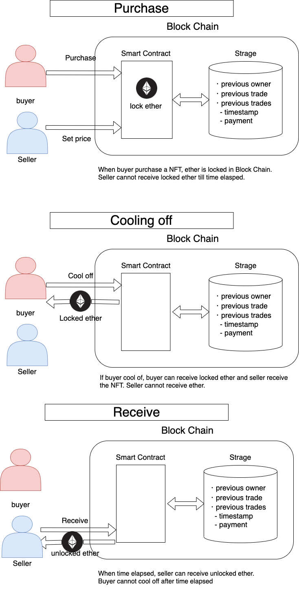
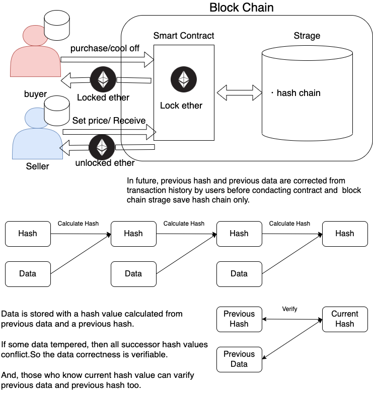

# Decentralized Anti-Scam
we are members of the GEMMA Network company, a project of layer1 and soon launched.
But today, we want to introduce a project about anti-scam NFT, which starts with this hackathon.
The project members are Fizz, Buzz, Shoh.

Our product is “Non-Fungible Token with Decentralized Anti-Scam”.

## Conventional NFT Problems
NFT Arts are called unique and fangible, and cannot be duplicated, so many people are interested in it.
Digital Art creators think that if they create NFT of their digital arts not to be copied, then they are safe from plagiarism.
And those who buy NFTs can be certified by Blockchain Authorities.
NFT is guaranteed to be fungible by Smart Contract technology.
But, it is fungible as a token only in the Smart Contract includin’ it.
There is no guarantee that NFT for a digital or real art is unique and an image referred to by NFT metadata is never changed.
For those reasons, there are many scam NTFs to famous arts,
as  someone evil copies the whole smart contract and mints copy NFT which has the same Metadata so refers to the same digital contents.
We can hardly distinguish them from only information about Smart Contract, Token and Token Metadata.

## General Solution
To get correct NFT (not scam NFT), people take it important that the exchange platform or smart contract platform is reliable.
Of course, a big organization of authority can defend us from risks like scam,
but at the same time little meaning remains to use NFT, a decentralized platform.
We think this solution is not enough.

## Our Solution
Our Approach to Scam NFT is, Cooling-Off System.
We create it on a smart contract, so the system is decentralized.
(So no worry about conduction of cooling off)

This NFT can be traded with ethereum on Smart Contract.

This Contract has a cooling-off time limit and a purchaser can cool-off the trade.
The purchaser will get back the same amount of ethereum and NFT will go back to the previous owner at that time.

When trading occurs the ethereum sent from a purchaser is locked to Smart Contract while cooling-off term.
After the expiration of the cooling-off term, the previous owner can get the ethereum.

## How our systems defend us from scam NFTs
In occasion that famous creator release a NFT art and sale on a decentralized exchange platform of NFT,
copied scam NFTs are created immediately.
There is a chance to buy an incorrect NFT, so a consumer cannot buy the NFT easily.

But if the true NFT is minted on Cooling-off Smart Contract, 
consumers can judge a non-cooling-off contract as a scam.
And if a scammer create copied NFT on cooling-off Smart Contract,
they have to take risks of cooling-off. And if it happens, they just paid a transaction gass fee with no returns.
So they might hesitate to create a scam NFT as a cooling-off token.
And actually if the token is revealed as a scam after a while, it would be returned to the scammer.
In short, this system imposes scammers to take cooling-off risks and reduses scam NFTs by its economic systems.

## Why Decentralization is needed for reliablity of NFT
Before talking about decentralization, let us explain about blockchain general problems.
What we call the blockchain trilemma is decentralization, tps, and security.
These are very important issues and a lot of discussion and attempts are taking place.

But this topic is so highly technical that blockchain, smart contracts users cannot understand deeply and also rarely have an interest.
This is another crucial lemma in the web3 industry as a social problem from some aspects.

First, as a target of investment.
Blockchain is great technology and it will be more and more worthful.
Many people bought BTC for investment purposes and BTC got higher and higher last year.
However, they didn’t buy cryptocurrency for they think it is great technology and they hope it to be more useful
but they just hope it will be a higher price and give them profit.
So they buy BTC on risk-on phases such as inflation and sell most of it on risk-off phases such as FRB raising interest rates, or some incident like Luna.
This volatility causes huge problems to our industry and public like layoff in crypto companies.

Second aspect is the reliability and authority of the web3 industry.
Blockchain has many social problems, for instance money laundering and Ponzi schemes, scams and so on.
But most solutions are relying on conventional big company’s authority or governments while blockchain’s core concept is decentralization.
This means, some trouble or some error in organizations we think reliable causes huge panic like Lehman shock.

So we need to solve this problem in a decentralized and simple way to be understood by public Web3 users.

## Similar Atempts
There are some similar atempts. One project is trying to implement cooling-off logic on off-chain servers and DBs.
So logic and assurance of that project are centralized and they cannot pass this problem.

Another is EIPs. This is a sample code of solidity so it is only on Smart Contract.
It is a decentralized attempt but so little impact dose it have.

In sammury, Our product differs from them at following points:
1. cooling-off conduct on Smart Contract
1. Smart Contract use less strage (disscuss next section).
1. Example of not only Smart Contract but also web3 (node modules)

## Technical Challenges
We assume cooling-off can be conducted when the NFT is revealed as a scam.
Then cooling-off will cause the next cooling-off.

To calculation previous owners and cooling-off limit of trade and price to return ethereum,
we have to look over the transaction history of ethereum or memorize all the above information.

This is very hard for Smart Contract.
Smart Contract can hardly look at their huge transactions and memorize all above data on EVM storage for cost issues.

We solve it by using hash chain and create very low cost and fast Smart Contract

## Trasing History by Hash Chain
Hash chain is an anti-tamper technology.

Data is stored with Hash Value calculated from previous data and previous hash.
If some data is tampered, then all successor hash values conflict, which means hash calculated from stored data doesn't match stored hash.
So the data correctness is verifiable.

We can also verify whether data is correct or not using only hash value.
Now we use five storage mapping data on solidity for each token.
They are not needed.

## Futue Work
We keep developing both this smart contract and exchange platform as open source.
Now we've created Proof of Concept, so there might be vulnerability. 
More and more safe, more and more efficient storage contract we will make.

Furthermore, for we created on ethereum solidity, it is difficult to run contract at periodically or set time trigger.
After ethereum or other layer1 projects implement it, the payment ethereum which we lock on smart contract while cooling-off expires can be sent automatically. Then we can create more an efficient contract.

In addition, a hash chain on a block chain is great technique but it is complicated to implement to a platform.
Hash chain sample of solidity and web3 node modules are spin-off.
